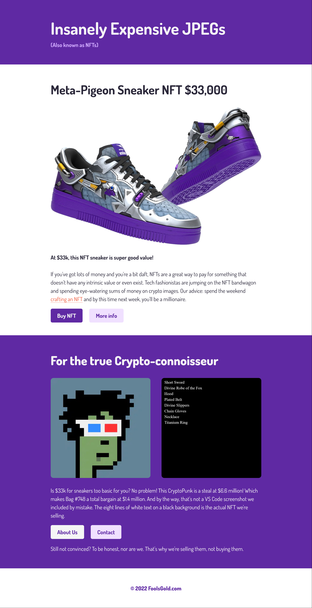
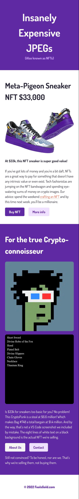

# Project Overview

This NFT landing page is inspired by the SCRIMBA course, but it features a unique twist. Instead of relying on traditional CSS for styling, this project leverages the power of SCSS (Sass) to enhance and streamline the design process. SCSS, a CSS preprocessor, allows for more efficient and maintainable styling, making this landing page a great example of modern web development practices. I have also made it mobile responsive.

## Technologies Used

- HTML
- SCSS

## Solution URL

- Solution URL: https://scrimba-nft-landing-page.vercel.app/

## Web App Images

- Desktop view

- Mobile view

## Additional Information

- You may clone and reuse this site for you own personal usage.
